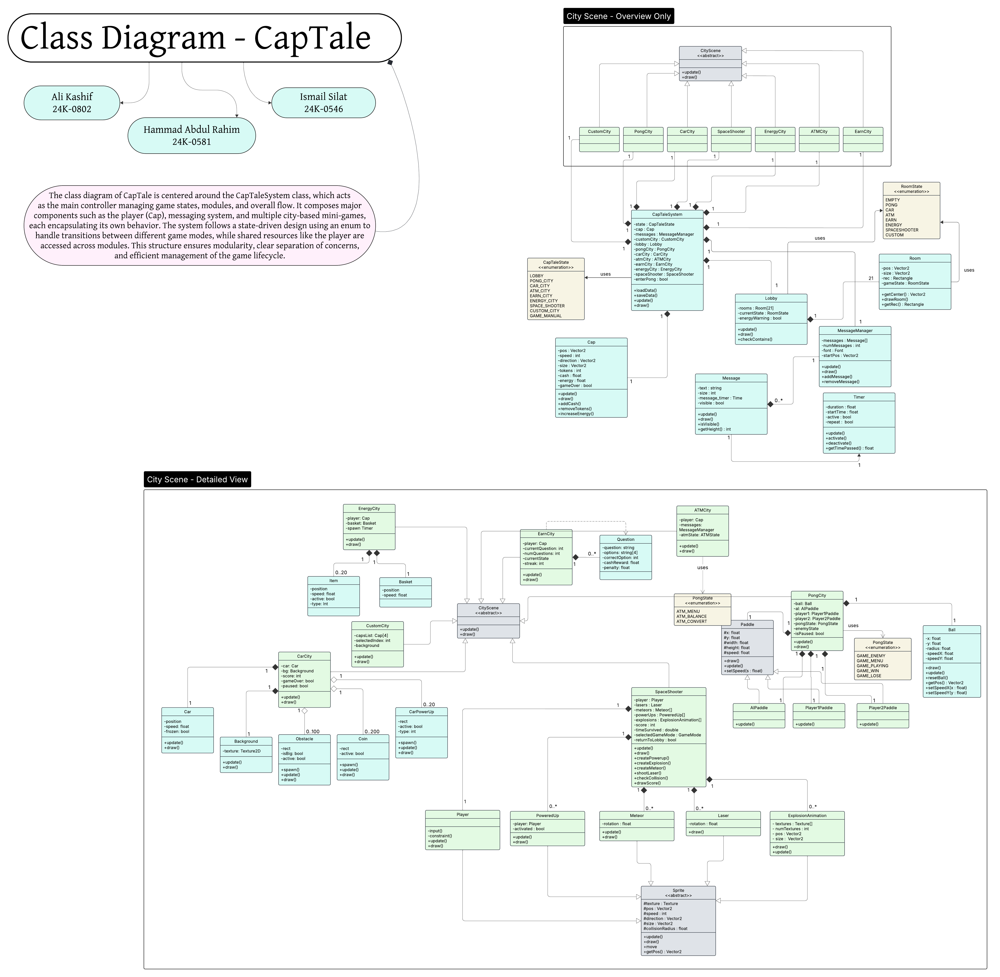

# Class Diagram - CapTale

The class diagram of CapTale is centered around the `CapTaleSystem` class, which acts as the main controller managing game states, modules, and overall flow. It composes major components such as the player (Cap), messaging system, and multiple city-based mini-games, each encapsulating its own behavior. The system follows a state-driven design using an enum to handle transitions between different game modes, while shared resources like the player are accessed across modules. This structure ensures modularity, clear separation of concerns, and efficient management of the game lifecycle.

This project uses Lucidchart for class diagram design. You can view the diagram using the link below directly on lucid chart:

[View the class diagram on Lucidchart](https://lucid.app/lucidchart/b5bb06e8-56ff-4be8-9d3b-11ec6b5de41a/edit?invitationId=inv_b7a4e678-f880-47f7-b66c-a244c6e45e3d)

Alternatively, you can view or download the diagram as a PDF or PNG:

- [Download PDF](Class%20Diagram%20-%20CapTale.pdf)
- [Download PNG](Class%20Diagram%20-%20CapTale.png)

